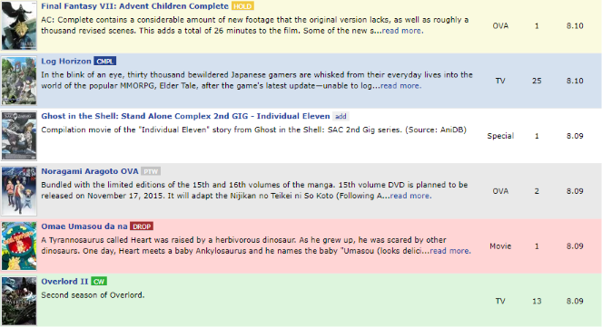

# MyAnimeList Colorizer

Adds colors based on status while browsing for anime or manga on [MyAnimeList](https://myanimelist.net/). Useful to be able to tell from a glance what you have and haven't seen. 

## Instructions

1) Install [Tampermonkey](http://tampermonkey.net/) or [Greasemonkey](https://addons.mozilla.org/en-US/firefox/addon/greasemonkey/)
2) Install [myanimelist-colorizer.user.js](https://github.com/davidluzgouveia/myanimelist-colorizer/raw/master/myanimelist-colorizer.user.js)

